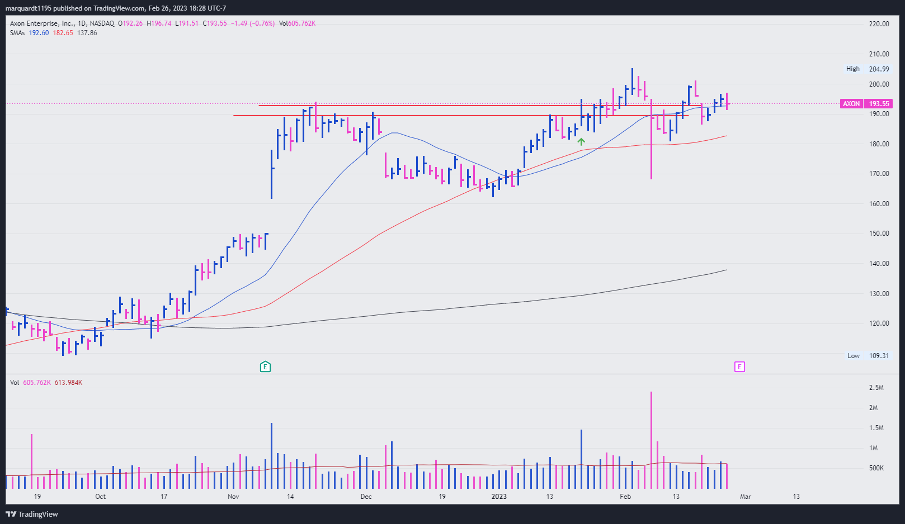
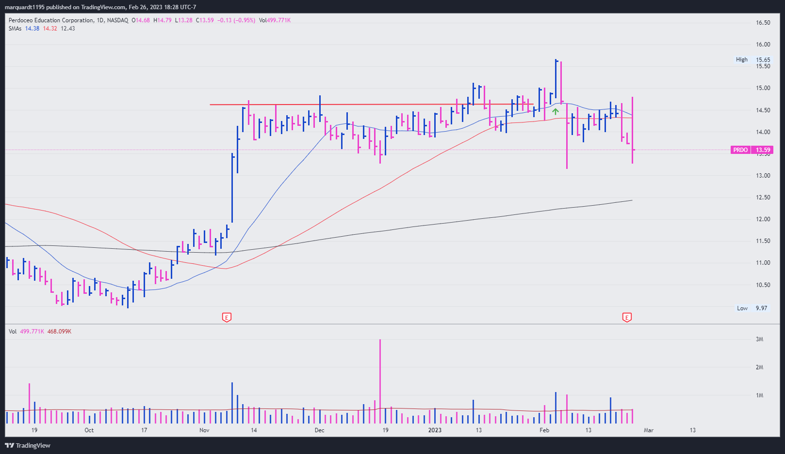

<style type="text/css">
  body{
  font-size: 11pt;
  font-family: Arial
}
.box {
  height: auto;
  width: 100%;
  background-color: hsl(233, 9%, 20%);
  color: hsl(233, 9%, 95%);
  padding: 30px;
  border: solid 1px black;
  border-radius: 10px;
}
</style>


```{r setup, include=FALSE}
knitr::opts_chunk$set(echo = TRUE)
```


```{r STEM Model, echo=FALSE, out.width="12%", fig.cap="Stock Feedback", fig.align='right'}
knitr::include_graphics("figures/red.png")
```

<div class="box">

## Journal
<br><span style="color:#FFFF99">*3/13/2023*</span><br>

Have taken some time away from the markets. Sold the last of VC on 2/28 just before trip with the boys and it turned out to be a great time to be away. The market saw major volatility during the past two weeks and individual stocks have been breaking down. Many pivot failures and a considerable amount of base failures. Looking back on my recent trades, stop losses have saved me from a lot of turmoil. Everything is lower than my sell points with the exception of: AXON, RXDX, and FRHC. <b>That means 13 of 16 stocks broke down after setting up.</b> This tells the whole story.

Some interesting and mostly negative developments include: Major distribution in the major averages. IWM, SPY, QQQ, and FFTY all got hit hard and the prospect of the indexes going lower doesn't seem far fetched. VIX spiked up again. SVB collapse and many banking stocks getting hit hard. Is this the start of something more serious? XLF has gotten clobbered; along with many other industries including XLE, XBI, XLE, XLB, and XME. FFTY barely above its lows. Interestingly, the yields have all taken big hits over the past 2-days. The 1-year got wrecked today. Would love to see this break down long-term. TAN coiling on the weekly. Will it break to the upside? <b>FSLR, MAXN, ARRY</b> all look pretty good. 

Sitting on the sidelines for the time being. Not interested in being the first to this party. Feels like we have a ways to go with this bear market. Staying engaged and ready.

Focus list: AEHR, FSLR, ARRY, PODD, EPAC, AAON, CECO, BOWL, ACLS, HROW, ESP, TMUS, MSI, MNST, TH, TRI, AQUA, LMB, MCHP, ADI, STM, WING, COCO. List added to index page today.

***

<br><span style="color:#FFFF99">*2/27/2023*</span><br>

A lot of reversals today with a small list of names setting up/breaking out. Also noticing a lot of bearish looking flags on the right sides of bases. Notable reversals on focus list include: CECO, TMUS, AXON, UPFT, GPC, VTYX, OCN, AGCO. Worth noting that both the SPY and QQQ's closed low in their range.

Interested to see what happens in these 'bearish flags' like: SANM, HROW, KLAC, TMUS, FLEX, . Are they tightening and consolidating or bracing to move lower? Feels like they'll go lower considering how poorly stocks have been acting. Lots of names breaking down/experiencing volatility: BELFB, BDC, IT, ALNY, TH, RELL, GILD, BIIB, ARRY, APH, PODD, IMCR. It's hard to get excited in this market. Rotation is fierce and breakouts to new highs simply aren't working. The bids dry up. Sometimes within minutes. Watching AEHR, MTZ, OCN, EPAC, ATRO, AGCO, and BOWL closely for anything promising. Earnings coming up in quite a few names.


***

<br><span style="color:#FFFF99">*2/26/2023*</span><br>
Personal STEM model created and set to red today. This is influenced by the recent change to red (on 2/23/2023) on the MPA platform but is, and will continue to be, based on my personal 'feel' of the market. My feel for the market is based primarily on feedback and amount of pressure from recent trades. Thus far, 2023 has been very similar to 2022 in that breakouts are not working. Volatility is too high for low-risk entries. Discipline and sit-out power will reign.

Big moves: FIX, TMDX, EME, ATKR, ALG

##### <u>2023 Reflection:</u>
My portfolio saw some volatility early on in SLGN and QSR. These were the first warning signs that I didn't take seriously enough. At that time, my largest position was XLE which began working immediately and looked promising. With 1 of 3 names working and more names setting up, I decided to buy VC on 1/17 which went down-to-sideways for a few days post-buy. That same day and on 1/18, I got stopped on both QSR and SLGN. I let XLE and VC work and by 1/23 I was up on both positions and green on balance; with that, I decided to buy VTYX and AXON on 1/23. Both worked immediately. 

I then added RXDX, IBB, and BIIB over the 26th and 27th. I got stopped on RXDX same day and sold a portion of VTYX for 2R on the 27th. Things were looking up for the most part. By 1/30 BIIB closed below 50-day and I sold half. IBB put me under pressure immediately but acted normal. On balance things were good until the end of the first week in February when I got stopped on ADEA, PRDO, and AXON. PRDO was the first real shot across the bow. Beautiful breakout that came all the way back.. all too familiar. Note: I tried buying more PRDO when it came in early morning post-b/o and it hit me harder when it underwent a pivot failure. This hasn't worked and shouldn't be done again. AXON was acting perfectly (though subject to pullback) until it broke over 14% in one day and stopped me out. This should have been a glaringly obvious sign to stop buying and go into protective mode. However, I kept buying and added FOLD and FRHC. A week later I added OIH, APH, and XENE. OIH was the only acceptable buy of those final 5. Otherwise, FOLD, FRHC, APH, and XENE were all <u>BAD BUYS</u> and can be attributed to FOMO. I need to be quicker to adjust and interpret the feedback the market is giving me.

In hindsight I can see how the 'breadth thrust' and new wave of setups made me overly eager to get into the market. Both Mark's were buying and admit to being down slightly (1-2%) so far this year. I'm right there with them, so I'm not too upset about the performance because I remained conservative and adhered to stops. But this latest run taught me that I'm not reflecting/synthesizing the market feedback enough each day. Hence, the advent of my STEM model and journal.

Down about 2.5%, or ~$360, as of this writing.

{width=49%}
{width=49%}

</div>