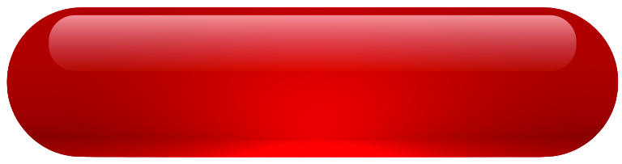

<style type="text/css">
  body{
  font-size: 11pt;
  font-family: Arial
}
.box {
  height: auto;
  width: 30%;
  background-color: hsl(233, 9%, 19%);
  color: hsl(233, 9%, 87%);
  padding: 10px;
  border: solid 1px black;
  border-radius: 10px;
}
</style>


```{r setup, include=FALSE}
knitr::opts_chunk$set(echo = TRUE, warning = FALSE)
```

```{r STEM Model, echo=FALSE, out.width="12%", fig.cap="Stock Feedback", fig.align='right'}

```

```{r Library, include = FALSE}
library(kableExtra)
library(reactable)
library(DT)
library(data.table)
library(tidyverse)
```


```{r, echo=FALSE}
focus1 <- c("AEHR", "FSLR", "ARRY", "PODD", "EPAC", "AAON", "CECO", "BOWL", "ACLS", "HROW")
focus2 <- c("ESP", "TMUS", "MSI", "MNST", "TH", "TRI", "AQUA", "LMB", "MCHP", "CDNS")
focus3 <- c("ADI", "STM", "WING", "COCO")

n <- max(length(focus1), length(focus2), length(focus3))

focus4 <- data.table(focus1 = focus1[1:n], focus2 = focus2[1:n],focus3 = focus3[1:n])


```


<center>

### FOCUS LIST

<div class="box">
```{r, echo=FALSE}
reactable(focus4,
            defaultColDef = colDef(
            align = "center"),
          columns = list(
            focus1 = colDef(name = "-----", 
                           width = 75),
            focus2 = colDef(name = "-----", 
                           width = 75),
            focus3 = colDef(name = "-----", 
                           width = 75)),
          theme = reactableTheme(
            color = "hsl(233, 9%, 87%)",
            backgroundColor = "hsl(233, 9%, 19%)",
            borderColor = "hsl(233, 9%, 21%)",
            stripedColor = "hsl(233, 12%, 22%)",
            highlightColor = "hsl(233, 12%, 24%)",
            inputStyle = list(backgroundColor = "hsl(233, 9%, 25%)"),
            selectStyle = list(backgroundColor = "hsl(233, 9%, 25%)"),
            pageButtonHoverStyle = list(backgroundColor = "hsl(233, 9%, 25%)"),
            pageButtonActiveStyle = list(backgroundColor = "hsl(233, 9%, 28%)")),
          striped = TRUE,
          highlight = TRUE,
          bordered = TRUE,
          width = 230)
```

</div>

</center>