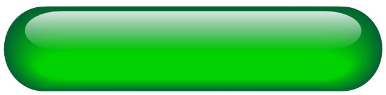

<style type="text/css">
body{
  font-size: 11pt;
  font-family: Arial
}
.box {
  height: auto;
  width: 30%;
  background-color: hsl(233, 9%, 19%);
  color: hsl(233, 9%, 87%);
  padding: 10px;
  border: solid 1px black;
  border-radius: 10px;
}
img[src$="#round"] {
  margin: 0px;
  border-radius: 5px;
}
</style>


```{r setup, include=FALSE}
knitr::opts_chunk$set(echo = TRUE, warning = FALSE)
```

```{r STEM Model, echo=FALSE, out.width="11.5%", fig.cap="Stock Feedback", fig.align='right'}
knitr::include_graphics("figures/red.png")
```

```{r Library, include = FALSE}
library(kableExtra)
library(reactable)
library(DT)
library(data.table)
library(tidyverse)
```
<center>

### WEEKLY CHARTS TO WATCH

<center>ADI, FTNT, MCHP </center>
[{.img-thumbnail width=33%}](figures/focus/ADI-weekly-focus.png#round)
[{.img-thumbnail width=33%}](figures/focus/FTNT-weekly-focus.png#round)
[{.img-thumbnail width=33%}](figures/focus/MCHP-weekly-focus.png#round)

<center>MSI, TRI, TSCO</center>
[{.img-thumbnail width=33%}](figures/focus/MSI-weekly-focus.png#round)
[{.img-thumbnail width=33%}](figures/focus/TRI-weekly-focus.png#round)
[{.img-thumbnail width=33%}](figures/focus/TSCO-weekly-focus.png#round)

***

{width=33%}
{width=33%}
{width=33%}

{width=33%}
{width=33%}
{width=33%}

<br>

### STOCK FEEDBACK MODEL

{width=21%}{width=21%}{width=19%}
</center>
<br>

<font color="green">GREEN</font>=Breakouts are working well, holding stops and following through - consider aggressive trading.

<font color="orange">ORANGE</font>=Market is selective and/or highly rotational. Reversals, squats, and pivot failures more likely - can trade but exercise caution.

<font color="red">RED</font>=Breakouts are not working well, risk is high - maximum caution advised!
